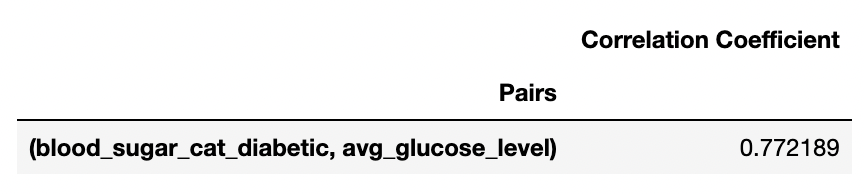

# Phase 3 Machine Learning Classification Project - Stroke Dataset


**By:** Jordana Tepper, Troy Hendrickson, Viktoria Szontagh

## Overview

This project analyzes existing data about various individuals - some who have had a stroke and many who have not - and their basic life and health information such as their age, BMI, smoking status, and average glucose levels. We use this data in order to develop a predictive model that can aid a stakeholder, Mount Sinai Hospital in New York, in determining whether or not a patient is at risk for a stroke during surgery. Although this data does not specifically discuss surgeries, an increased risk of stroke in general is likely linked to a risk of stroke during surgery. After utilizing the process of exploratory data analysis, we create several classification models to eventually reach the model with the highest and most appropriate recall.

## Business Problem

Given that, globally, strokes are the 2nd leading cause of death (World Health Organization), and strokes are a common complication of surgery, The Mount Sinai Hospital in New York needs a preliminary screening test to assess a patient's risk of a stroke during surgery and determine if further screening should be done.

Furthermore, in a hospital, when people's lives are at risk, it is crucial to minimize the risk of misdiagnosing a patient, or in our case falsely declaring that a patient is not at risk for a stroke (false negative). Consequently, given our stakeholder, we prioritize limiting the number of false negatives cases and therefore maximizing the true positive rate (recall).

## Data Understanding

The data that we use for our project comes from a dataset from Kaggle titled, 'Stroke Prediction Dataset'. This source is comprised of basic life and health information from various individuals - some who have had a stroke and many who have not - such as age, BMI, presence of heart disease, type of work, and martial status.

## Modeling

After doing some data cleaning, We perform a 80%-20% Train-Test Split on the data with a history of stroke as the target variable and all other variables as the predictors. Next, We create several classification models.

Recall was the main metric used to determine the accuracy of our model due to the fact that we are interested in using our model to detect stroke risk, and therefore, a false negative is more costly than a false positive.

False Negatives are individuals who were said to not have had a stroke but did.

False Positives are individuals who were said to have had a stroke but did not.

The following models were used on the testing set:

1. Baseline Logistic Regression
2. **Logistic Regression with Optimal Threshold - Final Model (Threshold: 0.446)**
3. Decision Tree
4. Tuned KNN (K-Nearest Neighbors)
5. Tuned Random Forest Classifier
6. Tuned XGBoost
7. Gaussian Naive Bayes
<p align="center">
   

<p/>

## Evaluation

### Why did we chose the Logistic Regression model (recall of 92%) rather than the Gaussian Naive Bayes model (recall of 94%) as our final model?
Although our main priority of this project was to maximize recall, the false positive rate that came with our highest recall outcome was too high for comfort. More specifically, the model that had the best recall was our Gaussian Naive Bayes model with a recall score of 0.94 but a false positive rate of 0.60. In comparison, our Logistic Regression model with the optimal threshold (Model 1) had a recall score of 0.92 with a false positive rate of 0.29.

Therefore, we decided that we are willing to risk a 0.02 difference in our recall for the sake of having a false positive rate that is more than half the size of that of the model with the best recall score.

Since our model would be a preliminary screening, part of the logic behind this decision is that we would like to lower the likelihood of causing someone who tests positive for stroke risk but is not actually at such risk (false positive) to have to pay the unnecessary costs that would come with further screening.

### More on Logistic Regression
While complex models often result in the best outcomes, this was not the case for us. Instead, our best results were produced by one of the simplest and straightforward models in our project: Logistic Regression. This is likely due to the fact Logistic Regression models tend to perform well when the target variable is naturally dichotomous, which was the case in our dataset: no stroke ('0') or stroke ('1'). Another factor that contributes to the effectiveness of Logistic Regression is when there is little to no multicollinearity between the independent variables. As seen from the correlation table below, our predictor variables were not highly correlated one another based on the assumption that a Pearson correlation coefficient of 0.7 or higher indicates multicollinearity; there is only one correlation of this degree. Therefore, we can say that our dataset meets this condition of Logistic Regression. 

All in all, one can say that for simple problems have simple solutions.

#### Correlation Coefficients with Values of 0.7 or higher:
<p align="center">
    
</p>

### Confusion Matrix
<p align = 'center'>
   
</p>

We have 4 false negatives, 46 true positives, 276 false positives, and 680 true negatives from our testing set.

### ROC-AUC (Area Under the Curve)
<p align = 'center'>
   
</p>

The optimal True Positive Rate and False Positive Rate are denoted by the red dot on the graph, which are provided by the optimal threshold of ~0.446.

<p align = 'center'>
  
</p>

The AUC is 0.85 which is good in terms of the goals of our project. In other words, we maximized the true positive rate (recall) as much as possible while also keeping our false positive rate at an acceptable level.

## Conclusions

### Limitations

While our machine learning classification project proved that it can correctly predict people at risk of stroke 94% of the time, we have no information on how effectively a medication can reduce the risk of stroke. In other words, identifying someone as 'at risk' for a stroke doesn't take into account how medication can reduce this risk.

Furthermore, an additional limitation to our project is that there were missing values in the 'bmi' column of our dataset leading us to estimate such values based on the median 'bmi' value. Perhaps the decision to estimate the missing values rather than drop them could have created unrealistic data points.

Another limitation of our project is that we do not know the demographics of the individuals in our dataset or which countries this data comes from due to confidentiality. As mentioned, our stakeholder is Mount Sinai Hospital in New York, but due to this limitation, we cannot guarantee that this data is representative of the US population.

### Next Steps

Due to limitations in the dataset, we had no information about:

* Cholesterol
* Family history of stroke
* Number of strokes
* Race (i.e., the likelihood of stroke among different races)

As the information above is often associated with stroke risk, we would like to secure more data and expand our model to see if the inclusion of such information would better our model's recall as well as reduce the number of false negatives even more.

## Repository Structure

```
├── data
├── images
├── .gitignore
├── Stroke Classification.pdf
├── stroke-machine-learning-classification.ipynb
└── README.md
```
